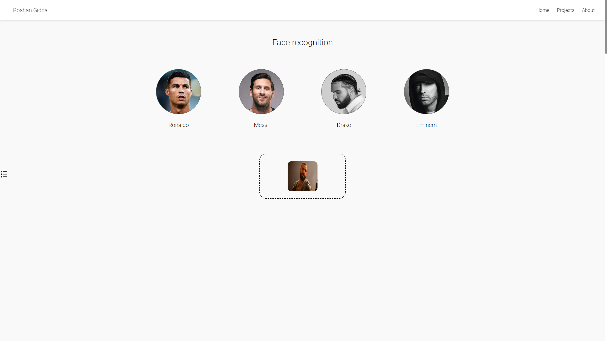

# Face Recognition System using DeepFace and Siamese Network

### Table of Contents

1. Introduction
2. Features
3. Installation
4. Usage
5. Model Architecture
6. Preprocessing
7. Predicting
8. Limitations
9. Future Improvements

## Introduction

This project implements a celebrity face recognition system using Python. The system leverages the DeepFace library [DeepFace](https://github.com/serengil/deepface) to detect and align faces within an image and a Siamese neural network for measuring similarity between faces. The model is designed to distinguish between two face images and determine whether they represent the same individual. See kaggle notebook for training: https://www.kaggle.com/code/roshangidda/classification-project

## Features

- Face Detection: Utilises DeepFace to handle raw image uploads to identify faces.
- Face Similarity: Feeds the preprocessed images into a Siamese network to output a similarity score between two faces.
- Custom Siamese Network: Trained on labeled data to output similarity between images.

## Installation

To get started, clone the repository and install the required libraries.

```
git clone https://github.com/XXRG456/facerecognition.git
cd facerecognition
pip install -r requirements.txt
```

Key dependencies are:

- Python 3.x
- TensorFlow==2.15.0
- deepface==0.0.92
- Numpy
- OpenCV

## Usage

1. Prepare your images: Simply create a folder of your images. Or run with test image.
2. Run:  ``` python main.py ```
3. View output: The system will return a similarity score between the two images, where a score closer to 0 means the images represent the same person, and a score closer to 1 means they represent different people.

### Front-end Usage

1. Drag and drop image into dropbox for classification. Or click dropbox to open folder and select image:


2. Wait for model to predict:


3. Inspect results:


## Model Architecture

The face recognition system uses a Siamese neural network to compare two face images. The architecture consists of:

- Two identical subnetworks for feature extraction.
- Euclidean distance used to measure similarity between feature vectors.

#### Network structure:

         Input 1              Input 2
            |                    |
        Conv Layers          Conv Layers
            |                    |
        Dense Layer          Dense Layer
            |____________________|
                Euclidean Distance
                     |
               Similarity Score

## Preprocessing

Before feeding images into the Siamese network, several preprocessing steps are applied:

- Face Detection: DeepFace detects and crops faces.
- Resizing: The images are resized to a fixed size for input into the neural network.
- Normalisation: The pixel values are normalised to ensure consistency in training and inference.

## Predicting 

In order to predict, the model needs anchor images to compare to. These anchor images are ground-truths for all classes. Then if we take a image we would like to predict, we pair the image with the anchor images:

- Create anchor images.
- Pair prediction image with anchor images.
- Feed all pairs through model.
- Take the average distance for each class.
- Then assign class to smallest distance.

## Limitations

- This system was trained a small dataset, meaning the model will struggle for unseen faces.
- Model may struggle with low-quality images.
- False positives can occur with faces who have similar features.

## Future Improvements

- Train on a larger dataset will improve the models ability to generalise.
- Data augmentation to improve the models robustness.


